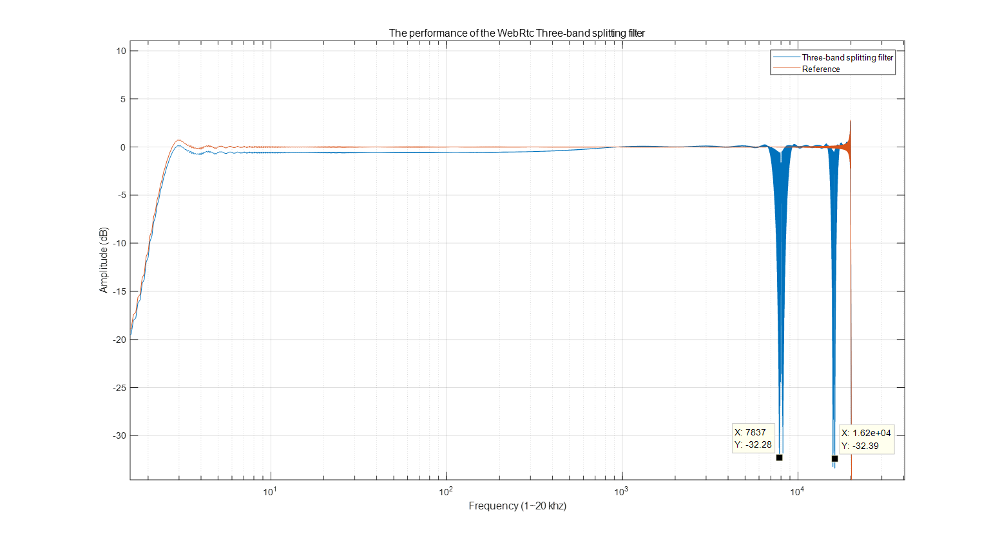
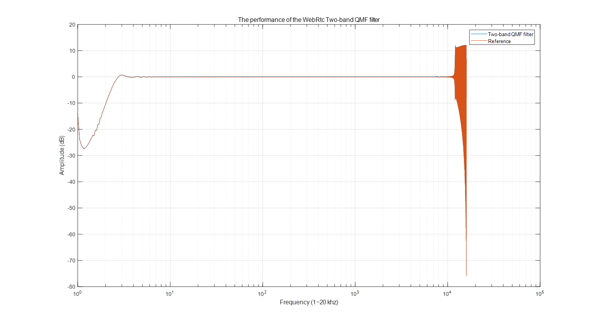

# The performance of Splitting filter

Below is the performance of the WebRtc's three-band splitting filter and the two-band splitting filter. We can find that there are two -30dB notches located at around 8khz and 16khz  in the frequency response of the three-band filter. Be careful with those cases when using in your production. 

When running in PC with a 1.8 GHz CPU, it costs about 1.4077 ms per analysis and synthesis operations,2.53 MIPS in the test. Meanwhile, apply the same test to the two-band QMF filter, it only costs 0.1865ms per analysis and synthesis operations,  0.355 MIPS. As it has been optimized with fix-point processing in the implement.

More details and usages please find the code in the Visual Studio project. These two splitting filter implements are captured from WebRtc and rewrote with C. 

-----
Measured with 0~20kHz swept-sine signal, the sample rate is 48kHz for the three-band splitting filter and 32khz for the two-band filter.

Reference from *Simultaneous measurement of the impulse response and distortion with a swept-sine technique* 

